# PivotTranslator 다이어그램

## 1. 아키텍처 다이어그램 (Architecture Diagram)

### 1-1. 전체 계층 구조 (Overview)

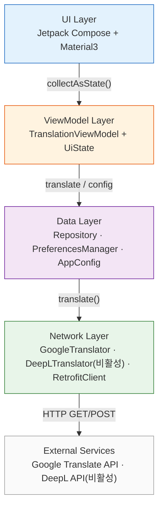

### 1-2. UI Layer 상세

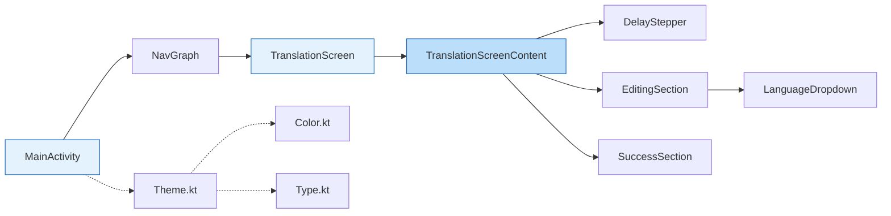

### 1-3. ViewModel Layer 상세

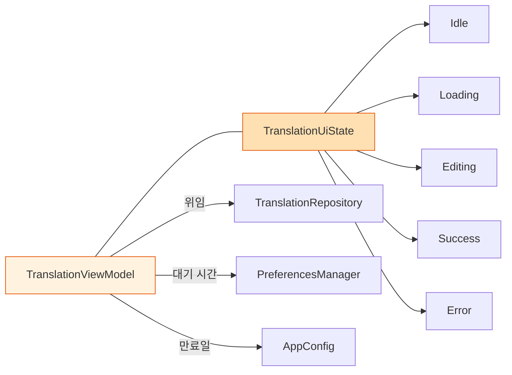

### 1-4. Network Layer 상세

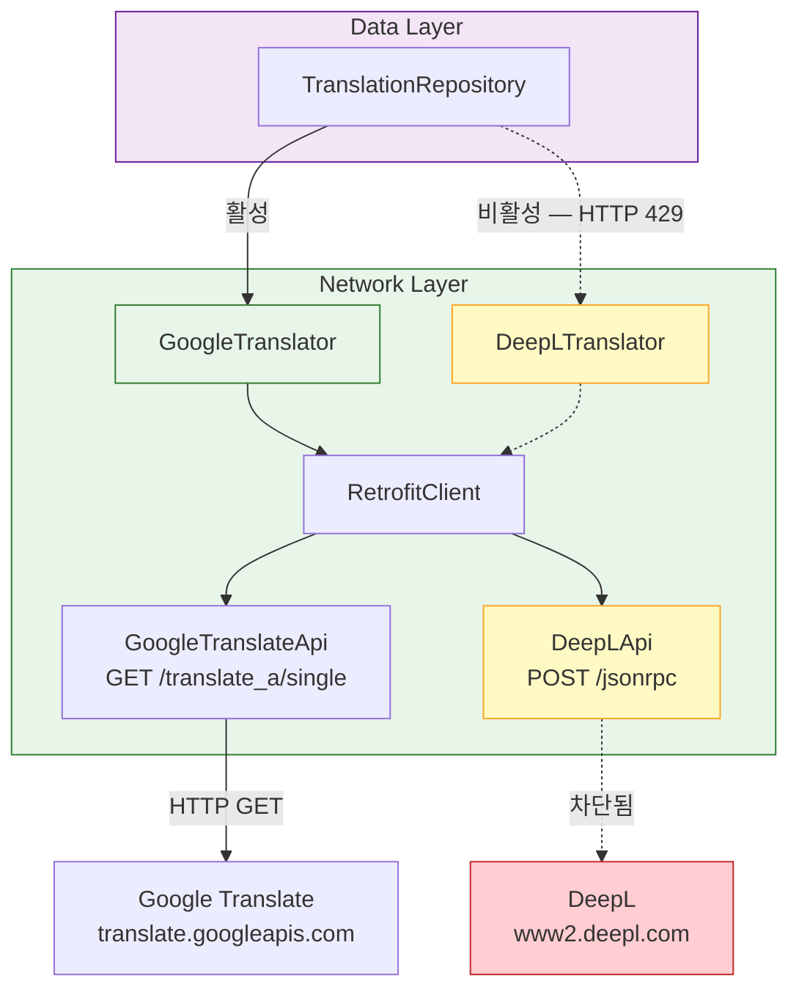

## 2. 데이터 플로우 다이어그램 (Data Flow Diagram)

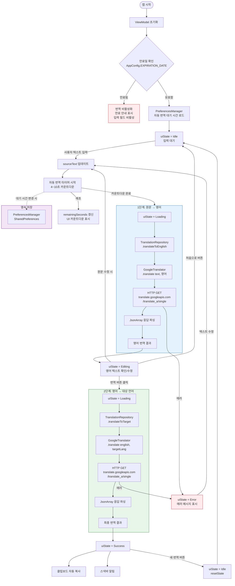

## 3. 시퀀스 다이어그램 (Sequence Diagram)

### 3-1. 전체 번역 플로우

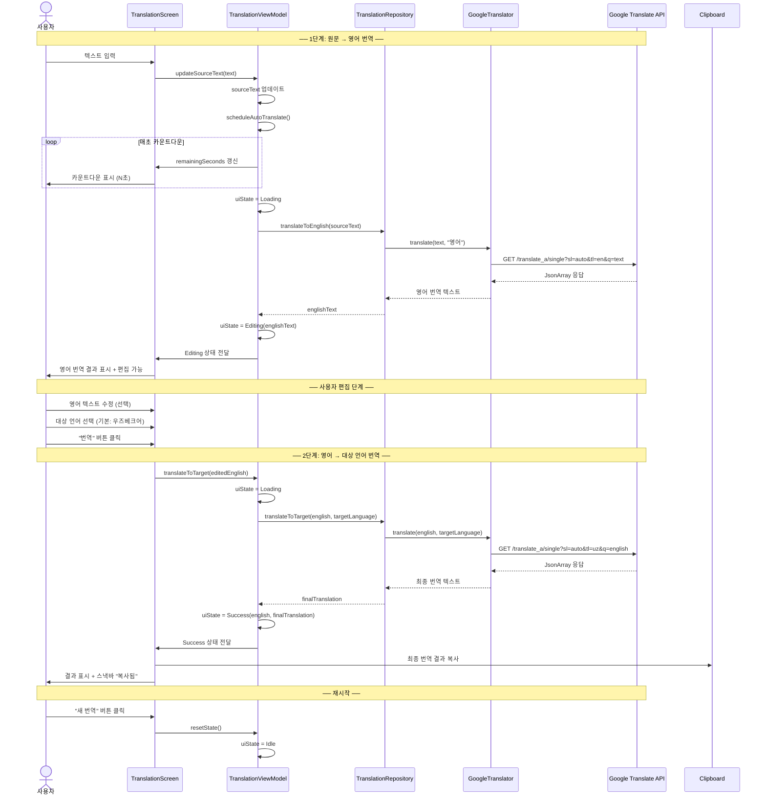

### 3-2. 자동 번역 타이머 & 설정 변경

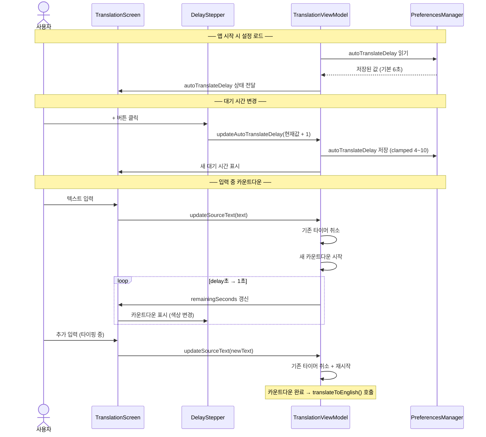

### 3-3. 에러 처리 플로우

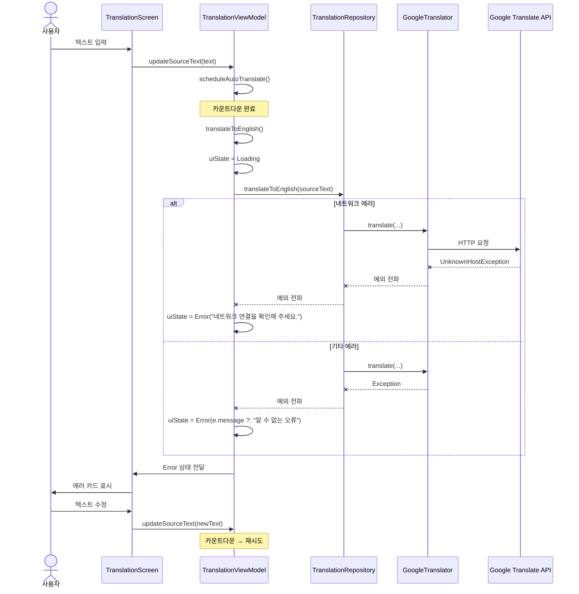

## 4. 컴포넌트 의존성 다이어그램

### 4-1. UI → ViewModel 의존성

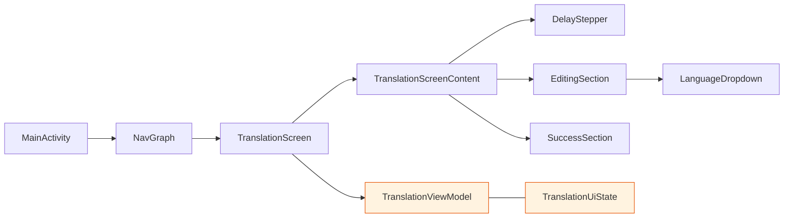

### 4-2. ViewModel → Services 의존성

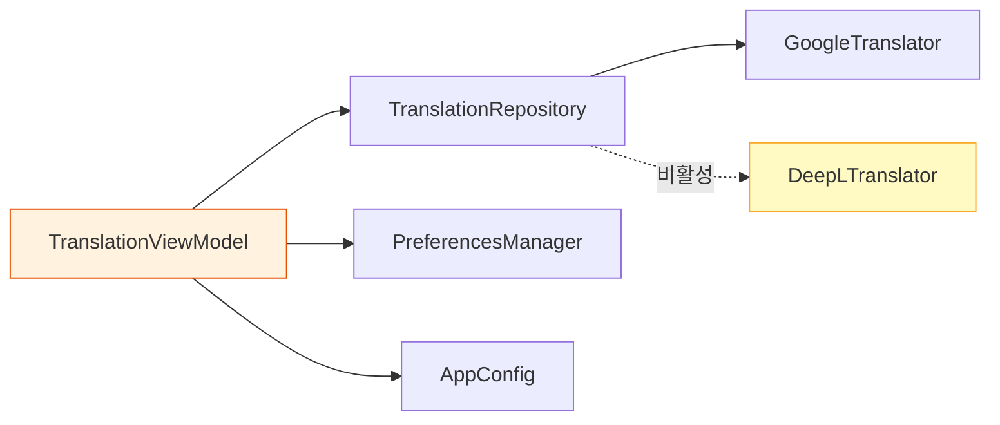

### 4-3. Network Infrastructure 의존성

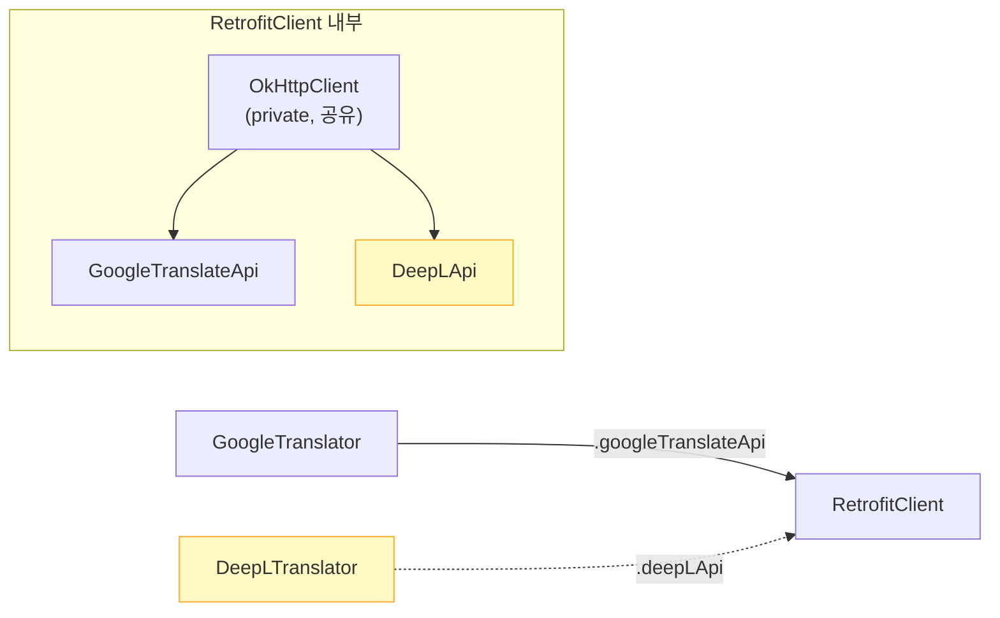

## 5. UI 상태 전이 다이어그램 (State Machine)

### 5-1. 정상 플로우 (Happy Path)

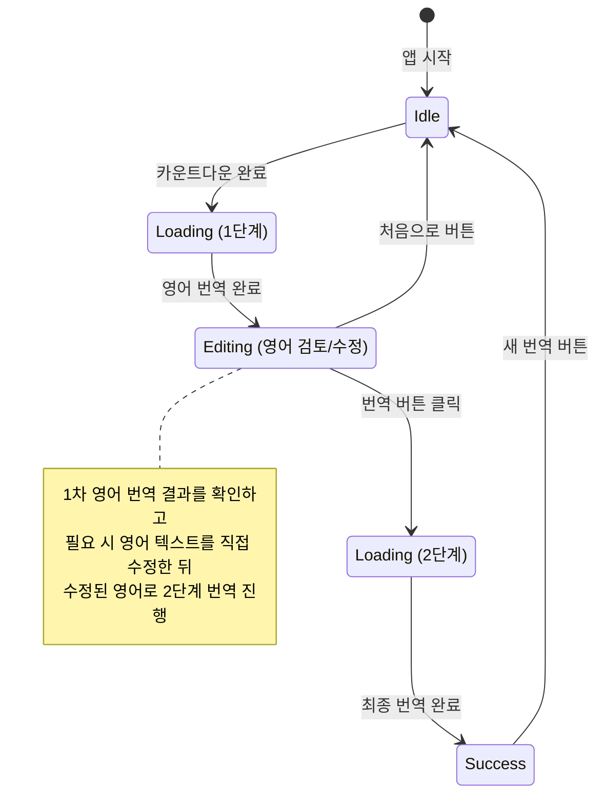

### 5-2. 원문 수정 플로우

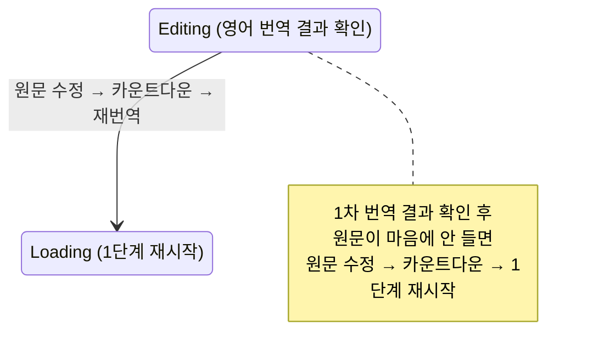

### 5-3. 에러 플로우

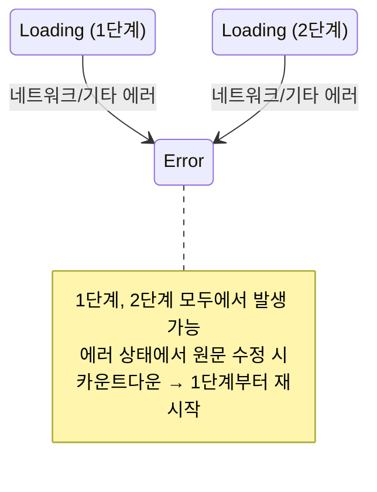
